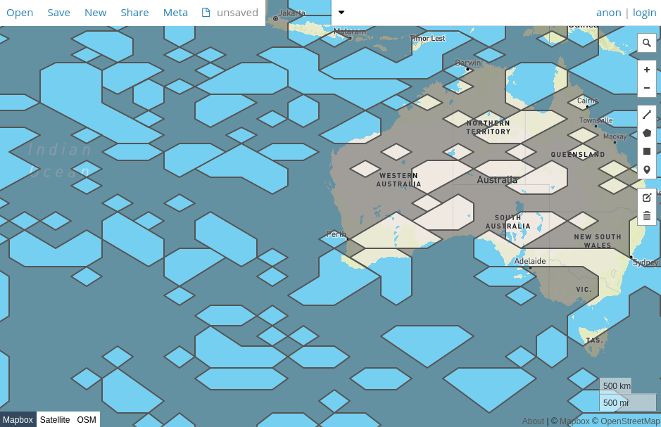

# sdsai

# [Homepage](https://basking2.github.io/sdsai)

Sam's Data-structures and AI - a collection of Java and Scala utility code.

## SDSAI Common

### Marching Squares

Marching Squares is an algorithm to take a raster of 1, 0, and -1 values
and produce polygons. This implementation can march a single tile or stitch
many tiles together into a larger tile. A simple use of this might be

        final byte p = 1;
        final byte n = -1;

        final Tile tile =
                new Tile(new byte[]{
                        0, 0, 0, 0, 0 ,0,
                        0, n, n, n, n, 0,
                        0, n, p, p, n, 0,
                        0, n, p, p, n, 0,
                        0, n, n, n, n, 0,
                        0, 0, 0, 0, 0 ,0,
                }, 6);

        final String geoJson = SimpleGeoJson.write(new VectorTileBuilder(tile, FeatureFactory.uuidProperty()).buildIsoband(), 5, 5);

        try (final OutputStream os = new FileOutputStream("SomeFile.geojson")) {
            os.write(geoJson.getBytes("UTF-8"));
        }

The following image was generated using GeoJson.io on one of the files 
produced by a unit test for the algorithm implementation.

This image was generated using GeoJson.io on one global temperature data
being filtered for values over 300 Kelvin.

## Links

* GitHub
  1. [sdsai](https://github.com/basking2/sdsai)
* SonaType
  1. [oss.sonatype.org](https://oss.sonatype.org)
  2. [issues.sonatype.org](https://oss.sonatype.org)
